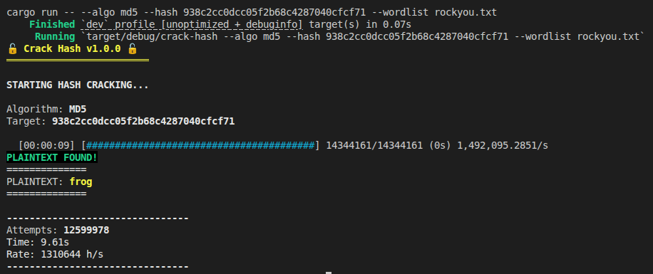

# Crack Hash

A fast, multi-threaded hash cracking tool written in Rust. This tool performs dictionary attacks against hashed passwords.



## Usage (Local)

### Prerequisites

- [Rust](https://www.rust-lang.org/tools/install) (1.70+)

### Build and run

```bash
cargo build --release
./target/release/crack-hash --help
```

Or directly with Cargo:

```bash
cargo run --release -- --help
```

---

## Usage (Docker)

If you prefer using Docker:

### 1. Build the container

```bash
docker compose build
```

### 2. Launch the container

```bash
docker compose up -d
docker compose exec crack-hash bash
```

### 3. Compile and run

```bash
# Inside the container
cargo build
cargo run -- --help
```

## CLI Arguments

| Argument | Short | Description |
|----------|-------|-------------|
| `--algo` | `-a` | Hash algorithm (md5, sha1, sha256) |
| `--hash` | `-H` | Target hash to crack |
| `--wordlist` | `-w` | Path to the wordlist file |

## Usage examples

- [MD5](/docs/md5.md)
- [SHA1](/docs/sha1.md)
- [SHA256](/docs/sha256.md)

## Contributing

Contributions are welcome. To contribute:

1. Fork the repository
2. Create a feature branch (`git checkout -b feature/your-feature`)
3. Commit your changes (`git commit -m 'Add your feature'`)
4. Push to the branch (`git push origin feature/your-feature`)
5. Open a Pull Request

Please ensure your code follows the existing style and includes appropriate tests.

## License

This project is licensed under the MIT License.

```
MIT License

Copyright (c) 2025

Permission is hereby granted, free of charge, to any person obtaining a copy
of this software and associated documentation files (the "Software"), to deal
in the Software without restriction, including without limitation the rights
to use, copy, modify, merge, publish, distribute, sublicense, and/or sell
copies of the Software, and to permit persons to whom the Software is
furnished to do so, subject to the following conditions:

The above copyright notice and this permission notice shall be included in all
copies or substantial portions of the Software.

THE SOFTWARE IS PROVIDED "AS IS", WITHOUT WARRANTY OF ANY KIND, EXPRESS OR
IMPLIED, INCLUDING BUT NOT LIMITED TO THE WARRANTIES OF MERCHANTABILITY,
FITNESS FOR A PARTICULAR PURPOSE AND NONINFRINGEMENT. IN NO EVENT SHALL THE
AUTHORS OR COPYRIGHT HOLDERS BE LIABLE FOR ANY CLAIM, DAMAGES OR OTHER
LIABILITY, WHETHER IN AN ACTION OF CONTRACT, TORT OR OTHERWISE, ARISING FROM,
OUT OF OR IN CONNECTION WITH THE SOFTWARE OR THE USE OR OTHER DEALINGS IN THE
SOFTWARE.
```
